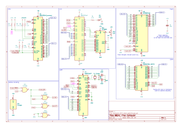

# L10 - Interrupts

[Lecture Slides](https://docs.google.com/presentation/d/1ql4iA12QAUZchFHpuHh8qrRp69Y3f6t2vwTTe2sls3A/edit?usp=sharing)

## Assignment

### Build



TODO: Picture

Build the above schematic on the breadboard.
An example board is provided for your reference.

### Test

The program `starter-code/interrupts.S` will do two things:
it will blink the LED on PA0, and display received UART data on the LCD screen.
Both of these tasks are performed using interrupts,
meaning that the CPU is free to do other tasks in the meantime.

In fact, if you look at the main loop after the setup is done,
you'll find the CPU is doing nothing at all between interrupts:

```
halt:
	; Our code is free to do whatever we want in here,
	; without worrying about checking for new data or timers.
	; The interrupts will just handle it whenever necessary!

	JMP halt
```