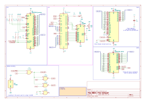

# L8 - Hello, World!

[Lecture Slides](https://docs.google.com/presentation/d/1wvtDUiQhjNTBSeLNdqbvOtbhu9fqqL-nmqj49V5dSQs/edit?usp=sharing)

## Assignment

### Build

TODO: Picture

Build the above schematic on the breadboard.
An example board is provided for your reference.

### Test

Before running any code, you need to adjust the contrast on your display,
otherwise you **will not see anything.**
Turn the potentiometer until there are white boxes on the top row,
but the bottom row is empty.

After adjusting the contrast, upload and run `starter-code/print.S`.
You should see the letter "A" fill the screen!

If you want, you can try modifying the code to print your own messages.