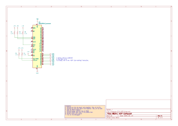

# L2 - The NOP Computer

Today we're going to discuss the very basics of what a "program" really is,
see how a CPU can execute programs,
and finally make our CPU run the very simplest program we can possibly run.

### Notation

The original version of the 6502 was released in 1975,
and programming syntax wasn't nearly as standardized as it is now.
For this class we'll be using the notation used by the 6502's documentation and all of the related tools,
shown in the table below.

| Name        | C Notation | 6502 Notation |
|-------------|------------|---------------|
| Decimal     | 42         | 42            |
| Binary      | 0b101010   | %101010       |
| Hexadecimal | 0x2A       | $2A           |

The important details is that `%` means **binary**, and `$` means **hexadecimal**.

Typically when writing large blobs of numbers (e.g. snippets of machine code) adding the `$` hurts readability,
so this book will omit the `$` for cases where there is no ambiguity.

### A Computer

As discussed last time, we defined a computer as a thing that can run programs,
where the program is simply a list of steps, or **instructions**.
In our case, the instructions are just a list of bytes.

The very basics of a computer, then, can be boiled down into two parts:
one part that contains the instructions to run, and another part that actually runs the instructions.

The part of the computer that actually runs the instructions is the
**central processing unit**, or **CPU**.
You likely already have heard of many varieties of CPU,
made by Intel, AMD, Apple, Qualcomm, etc.
It's important to note that a CPU by itself doesn't constitute a computer–
without instructions to run, it can't do anything!

So our basic model of the computer starts out as two boxes:
A CPU to run instructions, and storage to hold the instructions.

TODO: Insert diagram here

### The Data Bus

A possibly-obvious problem with the two-box model is that our two boxes
aren't connected in any way.
Somehow, a series of instruction bytes in the storage
need to make their way over to the CPU so that they can actually be run.
Fortunately, we invented a convenient way to move information very quickly back in the 1800s:
just connect the two boxes with some wires!

In our case, we use **eight wires** to connect the storage and the CPU,
one for each bit in a byte.
This collection of eight wires is called the **data bus**,
and it can transfer a single byte of data at a time to or from the CPU.
Every instruction the CPU will ever execute must, at some point, travel across the data bus.

TODO: Diagram

### The Address Bus

With the addition of a data bus, our CPU can now retrieve instruction bytes from the storage.
However, there's a problem:
how does the storage know which byte it should be sending?

Consider the following pseudocode:
```py
if virtual coin flip is heads:
    print "hello"
else:
    print "goodbye"
```

If the coin flip is heads, we need to be able to send over the bytes that will execute `print "hello"`,
but if the coin flip is tails, we need to send over a different set of bytes that will execute `print "goodbye"`,
and only the CPU knows which path is correct.

Thus, the CPU needs to be able to tell the storage what part of the program it wants next.
This is done with a group of sixteen wires called the **address bus**.
Unlike the data bus, which can sometimes be bidirectional, the address bus is always driven by the CPU.

For storage devices, the address bus is very similar to an array index.
The storage device will look at the address bus, and it will place on the data bus whichever byte is at that location/index.
If `$0000` is driven on the address bus, the very first byte in the storage will eventually appear on the data bus.
If `$0001` is driven on the address bus, the next byte of storage will eventually appear on the data bus, and so on.

TODO: Diagram.

### The Program Counter and Registers

We now know that the CPU can ask for the next program byte by putting an address on the address bus,
but how does the CPU know which address to ask for?

The answer is that the CPU has a tiny amount of storage inside of it called the **program counter** (or PC, for short)
that always holds the address of the next program byte. The program counter is 16 bits wide, big enough for just one address,
and will increment by one for each byte the CPU finishes reading from the program.

The program counter is an example of a CPU **register**.
A register is a tiny amount of storage *inside the processor itself* that can be *accessed rapidly*.
The 6502 has a handful of registers that we'll discuss later, when we start programming.

### Fetch, Decode, Execute

The process by which the 6502 (and every CPU currently in existence) runs a program involves two-ish steps:

1. **Fetch**: Read a program byte from storage
2. **Decode**: Figure out what the program byte means
3. **Execute**: Do what the program byte means

You may observe that I have listed three steps, not "two-ish."
That's because the decode step happens entirely inside the CPU and kind of gets blended with the execute step;
we can't control it and we don't really need to worry about it.
So, from our point of view, we have:

1. Fetch
2. (Decode and then) Execute

As it turns out, this is why every instruction on the 6502 takes a minimum of two steps:
first the CPU must fetch the byte for the instruction, and then it must do some action.

### The Clock

TODO:

### Reset

TODO:

## Hands-On Section

### Build




Build the above schematic on the breadboard.
An example board is provided for your reference.

Keep in mind that clean wiring solves most computer problems!

### Debugger Usage

To test our circuit, we can use the debugger.
You'll need to download the [debugger repository](https://github.com/SuperTails/byobc-debugger),
and run a command inside:

```
python ./console/debugger.py debug
```

You may need to use `python3` instead of `python`,
and you may need to specify the serial port with `--port`.

Once the debugger has started, the interface will look like the following:
```
RST
PC: 0000  A: 00 X: 00 Y: 00 P: 24 S: 00 seq_cycle: 1
ADDR: 0000
DATA:   EA
STATUS: sync:0 rwb:1 (R) RESB:0 nmib:1 irqb:1 vpb:1    |   PHI2: 0

> 
```

From top to bottom:

- `RST` indicates that the 6502 is currently being reset.
- `PC` indicates the value of the Program Counter. The values beside it indicate other registers.
- `ADDR` shows the current state of the address bus
- `DATA` shows the current state of the data bus
- The pin names on the `STATUS` line all correspond to identically-named pins on the processor.

Take note of the value of PHI2 (the clock) currently.
We can advance by half of a cycle (i.e. from low to high or high to low)
using the `h`alfcycle command.
Type `h` and press enter.
Observe that PHI2 changes.

The halfcycle command is useful,
but often halfcycles are too short--
most interesting behavior happens after a complete clock cycle.
The c`y`cle command advances PHI2 to the next time it will be high,
because not much happens when PHI2 is low.
Type `y` and press enter.
Some of the other values might change
because we've just stepped one clock cycle forward.

We'd like to step a few more cycles now.
We could type `y` again, but there's a convenient shortcut:
pressing enter with nothing at the prompt will rerun the last command.
Press enter repeatedly to step and observe the `sync` signal.
As soon as it becomes 1, stop:
we're about to fetch our very first instruction.

Observe the value of the address and data buses.
The data bus should show `EA`
(since, after all, that's how you connected the wires).

Step a few cycles and observe how the address bus and the sync pin change.
Based on this, how many cycles does the `NOP` instruction require?

Once you're done, use the `q`uit command to exit.