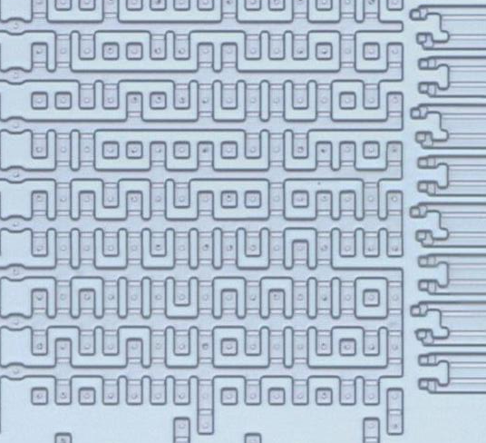
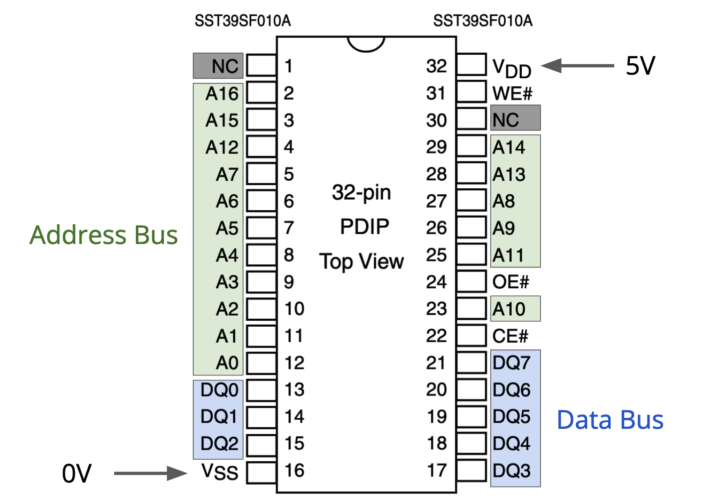

# L3 - Program Storage

## Lecture

### NOP Computer Recap

TODO:

### Today's Goal

Currently, our computer has only a single byte of program storage:
the eight wires we connected directly to the data bus are the only byte that will ever run.

Most interesting programs consist of more than a single byte though,
and in order to store those bytes we need another IC.

### Storage Technologies

There are a few key characteristics of programs
that dictate the way in which we store them:
- Most programs are not changed often (or changed at all).
- We typically want programs to persist even when power is turned off.

If we look back through history, these requirements were met in a number of ways (to name a few):
- Solid State Drives
- Hard Drives
- Installation CDs
- Floppy Disks
- Magnetic Tapes
- Punch Cards

Unfortunately, these methods all suffer from a significant drawback: they're complicated.
Our CPU expects to be able to just put an address in and get data out,
which simply isn't an efficient (or reasonable) way to use any of the above media.

This complexity problem is why computers new and old always have some form of much simpler storage
that *does* simply work like `address in -> data out`,
and we usually call this a **ROM**, for **R**ead **O**nly **M**emory.
For extremely simple systems, like microcontrollers, this ROM might be the only storage available.
For desktop computers, this ROM is located directly on the motherboard and will hold just enough code
to be able to set up and access e.g. a hard drive,
which will contain the rest of the operating system and your files.

#### Mask ROM

Read Only Memory has taken various forms throughout history.
The simplest approach is actually very similar to what we already did to our computer's data bus,
where we hard-wired specific bits to represent our data in an unmodifiable way.
A ROM in which the data is stored in the physical shape of the metal and silicon
is known as a **"mask ROM"**, because the data is encoded in the masks used to fabricate the device.
A picture of the insides of a mask ROM is shown below;
the pattern of metal connections is what stores the data.

#### PROM

The downside of a mask ROM is that making an updated version of the ROM is *extremely* difficult:
changing the layout of an IC can cost millions of dollars and require several months of time.
This is obviously not ideal if a company ships a product containing a mask ROM
that is later found to have a bug.

Often a more convenient form of ROM is **OTP**, or **O**ne **T**ime **P**rogrammable ROM,
typically just **PROM** for short.

The inside of a PROM looks much like a mask ROM, but with one key difference:
every possible bit starts connected.
To program the PROM, a high current is passed through the bits we would like to clear.
The heat of this current actually melts the very thin wire, disconnecting it permanently.
By selectively melting specific wires, we can permanently store a pattern of bits in our PROM
without needing to change the design at the factory.

#### EPROM

While a PROM allows us to permanently store data once,
this does mean that if we ever want to "update" the data,
our only option is to buy a second PROM and use it to replace the first one.
While much cheaper than remanufacturing the ROM,
this still isn't ideal if we'd like to make changes either for testing or for updates.

Thus, we need what is called an **E**rasable Programmable Read Only Memory, or EPROM.
An EPROM works by forcing electrons into an area they cannot escape from,
shown as the "float gate" area in the diagram below.
The charge (or lack thereof) on the floating gate then either allows or prevents a transistor from turning on–
effectively allowing us to "connect" or "disconnect" wires just like in the ROM and PROM.

In order to erase the EPROM so that we can reprogram it,
we need to get the electrons back out of the floating gate.
To do this, we actually leverage the power of the sun:
High-energy UV rays from sunlight strike the electrons and knock them out of the floating gate,
eventually discharging the gate and allowing us to store new data.
You can recognize an EPROM by looking for a window that allows the sunlight in, as shown below.

#### EEPROM

While the EPROM is very close to ideal,
unfortunately there are many engineers and developers that are allergic to sunlight and grass.
Also, the UV erasing process can take a few hours.

To finally arrive at our ideal stage medium, we have the
**E**lectrically Erasable Programmable Read Only Memory, or **EEPROM**.

The internal structure is very similar to an EPROM, but with one key difference:
Instead of needing sunlight to pull the electrons out of the floating gate,
we use quantum mechanics.
As I do not understand quantum mechanics, unfortunately I cannot elaborate further.
The upside is that both programming and erasing can both be done quickly and electronically,
making EEPROMs a very useful storage medium indeed.

#### Flash Memory

In fact, EEPROMs are so useful, that the same technology that is inside EEPROMs
is what is used for **flash storage**.
Yes, the very same "flash" as in "flash drive" and in solid state drives:
the disk that is likely in your computer can trace its roots all the way back to improvements on the mask ROM.

The differences between EEPROM and flash memory
are really just in terms of layout, density, and the exact encoding scheme used for the bits.
The primary thing one might notice when comparing EEPROM and flash
is that flash storage is larger and faster for the same price,
but it must be erased in large (often 4096 byte) blocks at a time,
unlike an EEPROM in which each individual byte can be erased and reprogrammed.

For our purposes, these differences are mostly superficial,
and flash memory is both much cheaper and has more storage.
Thus, we will be using the **SST39SF010A** 128KiB flash IC to store our programs.

### The SST39SF010A

The flash memory our computer will use is the SST39SF010A, whose
[datasheet is available on Microchip's website](https://ww1.microchip.com/downloads/aemDocuments/documents/MPD/ProductDocuments/DataSheets/SST39SF010A-SST39SF020A-SST39SF040-Data-Sheet-DS20005022.pdf).
The pinout diagram is shown below for convenience, with some annotations.

Most of the pins should be familiar:

- VDD should be connected to 5V
- VSS should be connected to 0V/GND
- A0 through A16 are the address bus
- DQ0 through DQ7 are the data bus

Reading data from the flash is very simple:
If you (the CPU) drive an address, the flash will return a stored byte driven on the data lines,
exactly as we want.
Note that we will need to do a little bit with those WE#, OE#, and CE# pins,
which we'll discuss shortly.

The NC pins on the flash stand for **No Connect**,
i.e. you shouldn't connect anything to those pins.
Usually NC just means the pins are unused,
but sometimes a no-connect pin activates some factory test functionality,
which we definitely don't want to use by accident.

Note that, because this is a 128KiB flash (i.e. there are 2^17 bytes) there are 17 address lines.
Our CPU only has 16 address lines,
which means that the last address line on the flash can't be (easily) used,
and so we can't use the whole storage of the device.
However, storage space will almost certainly not be a problem:
the entirety of Super Mario Bros on the NES could fit in just 32KiB!
Unless you're writing some *very* large programs you don't need to worry about space.

### Active Low Pins

In an earlier section we decided to read voltages as "HIGH" or "LOW"
rather than on/off or 1/0. It's now time to talk about why that's helpful.

*Usually*, holding a pin on a device HIGH causes that pin to activate,
where what "activate" means depends on the device–
typically something gets turned on, a counter counts up, outputs are driven, etc.
As such, we call most pins **active high**, because a HIGH signal means the pin is active.

However, active high pins are merely a *convention*.
It would also be perfectly reasonable to design ICs in such a way
that applying a LOW signal to a pin causes something to be active.
Such a pin would be called **active low**, because a LOW signal means the pin is active.

As it turns out, due to historical and physics reasons,
active low pins are fairly common.
Both the CPU and the flash IC have active low pins, though we haven't discussed them yet.

Different manufacturers use different notation for active low pins, but the common ones are:

- An **overbar** (e.g. FOO)
- A **B** suffix (e.g. FOOB)
- A **#** suffix (e.g. FOO#)

The overbar notation is borrowed from boolean algebra,
where it denotes inverting a signal.
The alternative notations exist for a very simple reason: trying to type an overbar is difficult!
The "B" suffix actually stands for "**B**ar" while being very easy to type.
The "#" suffix is more mysterious, but it illustrates a general rule:
if you ever see a weird symbol next to a symbol name, it probably means active low!

If we take a look at the pins on the flash IC we didn't discuss,
we can see that they all end with a #, which means that they're all active low.
Similarly, if you look at the pinout of the 6502, you'll find several pins that all end with a B,
and those too are active low.

To accompany our HIGH/LOW terminology,
let's adopt another pair of words to better communicate when a pin is active or inactive.
If a pin is active, we say it is **asserted**, and if a pin is not active, we say it is **deasserted**.

### Flash Control Pins

Now that we know about the meaning of active HIGH and LOW pins,
we can talk about what exactly the CE#, WE#, and OE# pins do on the flash.

CE# stands for **Chip Enable**,
which is the overall enable/disable for the flash chip.
If the chip enable signal is deasserted (HIGH),
the flash will do absolutely nothing: it cannot be erased or programmed and it will not drive any data outputs.
If the chip enable signal is asserted (LOW),
the flash will behave normally according to the other two pins (WE# and OE#).

WE# stands for **Write Enable**,
which is what allows us to erase and program the flash chip.
The procedure for using the WE# signal is a little complicated to discuss right now,
and programming procedure is handled completely by the debugger, so you don't need to worry about it.
For now, we can know that during normal operation the WE# pin should be deasserted (HIGH)
so that we don't accidentally erase any code.

OE# stands for **Output Enable**,
which activates or deactivates the data bus connection.
If the output enable signal is deasserted (HIGH),
the data outputs will not actually drive the bus and are effectively disconnected.
Note that "disconnected" explicitly means we aren't driving anything–it is neither HIGH nor LOW.
Right now that would leave our data bus floating, but this property will come in handy later.
If the output enable signal is asserted (LOW),
the data outputs will drive a byte and we can read data.

So, to summarize, if we just wanted our CPU to be constantly reading from the flash,
we would drive the flash's control pins as follows:

- CE# LOW to enable the whole chip
- WE# HIGH to prevent any erasing or programming
- OE# LOW to enable the data lines

### Connecting the Flash

If you look at the debugger PCB closely, there are two pins at the end of the "T"
labeled WE and PROG.
These two signals aren't part of the 6502:
they're an additional feature of the debugger be able to program the flash.

The debugger's WE# pin can go directly into the EEPROM's WE# pin.
The PROG# pin will be asserted whenever the debugger is busy doing erase and program operations,
and it's needed to shut off the OE# pin in order to avoid trying to read and write at the same time.

In other words, if PROG# is asserted (LOW), we need OE# to be deasserted (HIGH).
This allows us to do our erasing and programming without accidentally reading at the same time.

If PROG# is deasserted (HIGH), we need OE# to be asserted (LOW).
This allows our computer to function normally and read data from the flash.

This setup naturally calls for a NOT gate–which, as previously mentioned, can be done with a NAND gate instead.

As for the CE# pin, there's never really a reason we need to use it (since the OE# pin already works just fine),
so we can just leave the CE# pin always asserted (tied LOW).

To summarize:

- The address/data lines on the 6502 and the flash can be directly connected
- The WE# pin should be directly connected to the debugger's WE#
- The CE# pin should be tied LOW
- The OE# pin should be connected with some logic (shown in schematic)

## Hands-On

### Schematic

### Using the Debugger