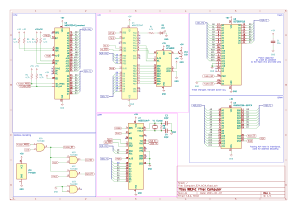

# L9 - Serial Communication

[Lecture Slides](https://docs.google.com/presentation/d/1RwEVXXA11jg1CMk1liAJUyXdV_C1u1YjqgMlVv8eloA/edit?usp=sharing)

## Assignment

### Build

TODO: Picture

Build the above schematic on the breadboard.
An example board is provided for your reference.

### Test

Open coolterm and set it to 115200 baud.
Use the serial port that is not in use by the debugger.
Upload and run `starter-code/serial.S` and you should see "Hello, world!".
You can type into coolterm to have text display on your screen.