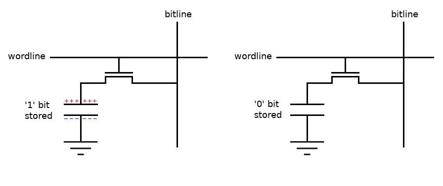
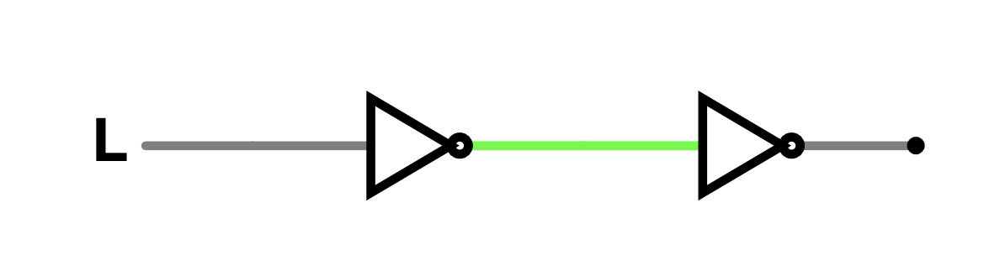
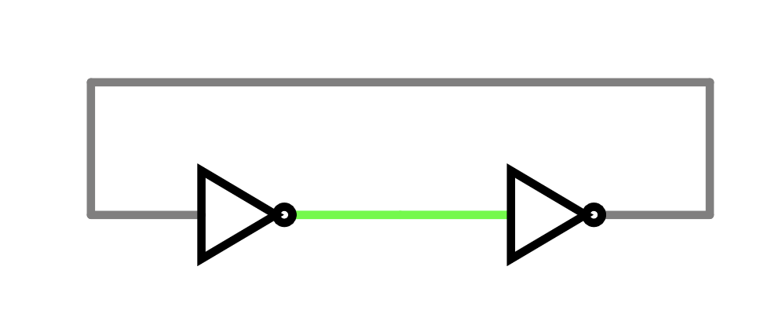
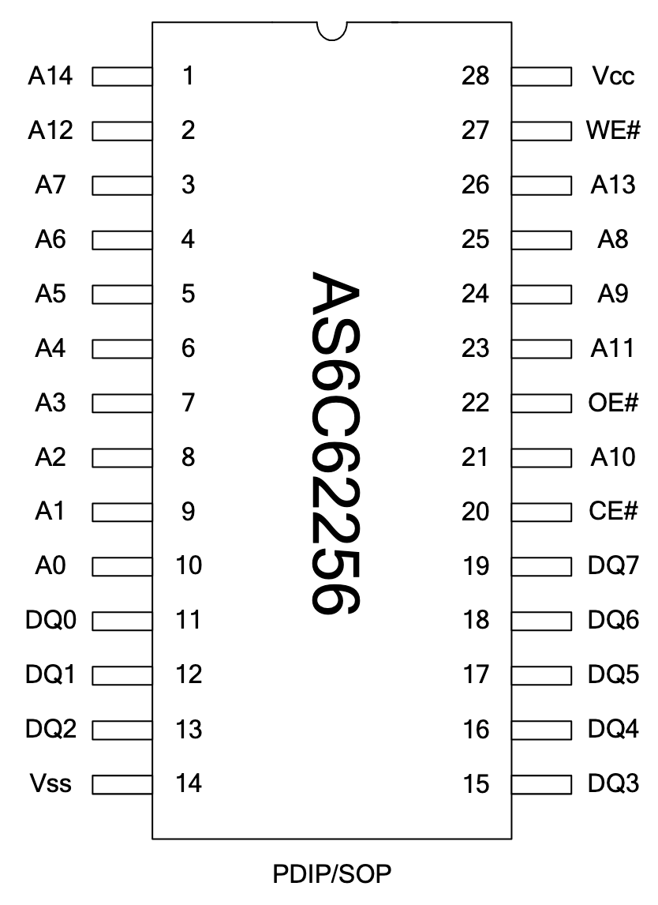
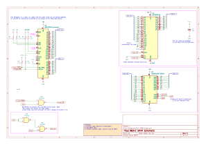

# L4 - Memory

[Lecture slides link](https://docs.google.com/presentation/d/1q7EyIV0wlpU1QVF2G2pjusn1N7IpYhQqCkGwILKG2ZA/edit?usp=sharing)

## Lecture

In this chapter we'll be talking about some consequences of real-world electronics
that caused the flash chips to not work in previous semester,
and then move on to discussing how we add memory to our computer.

### Decoupling Capacitors

TODO:

### Timing Problems

TODO:

### The Need for Memory

Picture a calculator that can let the user type some expression on a screen.
As the user types in numbers and operators,
our calculator program will need to store the current list of things the user has typed.
As the user types new characters, we need to write new things into our list.
To be more general: we want to store (somewhat) large amounts of temporary, quickly-updating data.

Last time we added flash storage to our computer,
so that it could store a program.
Conceivably we could use this same flash storage
to store numbers and symbols that the user is typing, so we can implement our calculator.

However, using the flash to store key presses is not a great idea.
Let's recall some of the properties of flash storage:

1. Simple to access (Just an address/data bus)
2. Non-volatile (Persists even when power is removed)
3. Infrequently updated (Takes a while to reprogram)

Point (1) is still very useful: the address and data buses are still our only tools for connecting to new devices.
However, (2) is not particularly helpful.
If the user turns the computer off, they probably don't care about whatever math they've typed anymore.
Point (3) is worse than 

TODO:

### RAM

To implement the main memory for our computer,
we want something with the following properties:

1. Simple to access
2. Fast when reading
3. Fast when writing

A medium with these properties is typically referred to as **RAM**,
or **R**andom **A**ccess **M**emory.
It's "random access" because we can read or write to any address within the RAM
essentially whenever we want.

For anything more than single-digit megabytes of space,
modern computers use **DRAM**, or **D**ynamic RAM.
The inside of a single bit of DRAM is very, very simple.


*Image from [All About Circuits](https://www.allaboutcircuits.com/technical-articles/introduction-to-dram-dynamic-random-access-memory/)*

A single capacitor is either charged (1) or discharged (0).
A single transistor, when turned on,
allows that capacitor to release its charge so that we can read the cell,
and subsequently we can charge the capacitor back up if we'd like.

Because DRAM requires so few parts per bit, it is incredibly dense,
which is why modern computers can have many billions of bytes of RAM available.

Unfortunately, DRAM has a significant drawback:
due to limitations of physics, the capacitors in DRAM will slowly "leak" and discharge over time,
which will erase all of your data!
In modern DRAM, the capacitors are *tiny*, which means that this leaking
can cause data loss in only tens of milliseconds.

As a workaround, DRAM is always built with another circuit that 
will **refresh** the data often–just reading what is currently stored,
and writing it back to charge up all the capacitors fully again.

Refreshing the data works great, except for another issue:
we can't use the DRAM while it's busy refreshing!
Thus, we need some kind of negotiation mechanism
to prevent our CPU from trying to access the DRAM while busy,
which is simple enough for modern hardware but exceptionally complicated for our system.

Thus, DRAM is not a great fit for our computer. We need something else.

### SRAM

The big advantage of DRAM was that it had high density;
you can buy lots of storage at relatively low prices.

However, our computer only can access 64KiB of memory anyways.
We care much more about ease of use and immediate availability than density!
Fortunately, there exists another solution: **S**tatic RAM, or **SRAM**.

To invent an SRAM cell, let's imagine putting two inverters back to back.



Whatever input we give to the two inverters will get inverted twice and come out unchanged.
So let's investigate what happens when we plug this circuit into itself:



We start with a 0, which gets inverted to a 1, inverted again to a 0,
which then feeds back into the loop.
If we started with a 1, then it'd be inverted to a 0, inverted again to a 1,
and again feed back into the loop.
In other words: we've made a loop that will constantly reinforce itself. This is storage!

.svg)
*By <a href="//commons.wikimedia.org/wiki/User:Inductiveload" title="User:Inductiveload">Inductiveload</a> - <span class="int-own-work" lang="en">Own work</span>, Public Domain, <a href="https://commons.wikimedia.org/w/index.php?curid=5771850">Link</a>*

An SRAM cell may look complicated, but it's actually just two inverters in a loop.
This scheme means that we never have to manually refresh the memory:
it's constantly keeping itself stable.
It's also fast, since we don't need to rely on carefully reading a tiny capacitor.

The drawback to SRAM is that it requires many more transistors per bit,
and thus for a given area you can't fit nearly as much storage and it costs more than DRAM of the same size.
But for our purposes, that's a very worthwhile tradeoff.

### Our SRAM IC

For our computer, we are going to be using the
[AS6C62256](https://www.mouser.com/new/alliance-memory/alliancememory-cmos-sram/)
32KiB SRAM.
Its datasheet, as always, can be found in the (TODO:) datasheets chapter.
Fortunately, the pinout should be very familiar.



Nearly every pin on the SRAM is identical to the pins on the flash!
And not by coincidence: this pin layout is standardized by JEDEC
(though it is unclear why the pins seem so scrambled).

Correspondingly, the way in which we use the SRAM
is almost identical to how we use the flash.

If we want to read data,
we simply pull CE# low (to enable the whole chip),
pull WE# high (to prevent writing),
pull OE# low (to allow reading),
put an address on the address bus,
and then the SRAM will drive some data on the data bus.

### Reading Rainbow

TODO: Reading

### Writing to SRAM

The key difference between SRAM and flash for our use-case
is that SRAM can be written just as easily and quickly as it can be read.

Writing to SRAM is very simple: 
You need to have CE# low,
input an address and the data you want to write,
and then bring WE# low. 
The data is written immediately once CE# and WE# are both low.

Fortunately, knowing when we want to write is simple:
The 6502's **Read/Write-Bar**, or **RWB**, pin
indicates whether the CPU wants to read (high) or write (low).
We can simply connect RWB directly to WE# and writing will be handled.

However, there's some edge cases we need to be careful about.
Note that the SRAM (or the flash, for that matter) doesn't have a clock!
This makes both the SRAM and flash **asynchronous** devices.
The asynchronous nature of our peripherals hasn't been a problem so far,
because we've only been reading data from SRAM and flash.
We can read from arbitrary locations whenever we want without consequences.
However, *writing* has permanent effects–we need to be careful about when and where we write.

### Write Timing

Ideally, every output of the 6502 changes exactly at the falling edge of the clock.
Say we go directly from reading some numbers to writing.

```wavedrom
{signal: [
  {name: 'ADDR', wave: '3456', data: ['1233', '1234', '4242', '1235' ]},
  {name: 'DATA', wave: '3456', data: ['AA',   'BB',   '17', 'CC' ]},
  {name: 'PHI2', wave: 'n...'},
  {name: 'RWB', wave: '1.01'},
],
 config: {hscale: 2}
}
```

The address and data should change at exactly the same time as RWB goes low,
which means the SRAM's WE# would go low,
which means we'd start writing to the correct address with the correct data.

Unfortunately, in the real world, the signals might not quite change at the same time.
Maybe the address might change a little bit later than the other signals:

```wavedrom
{signal: [
  {name: 'ADDR', wave: '3456', data: ['1233', '1234', '4242', '1235' ], phase: -0.5},
  {name: 'DATA', wave: '3456', data: ['AA',   'BB',   '17', 'CC' ]},
  {name: 'PHI2', wave: 'n...'},
  {name: 'RWB', wave: '1.01'},
],
 config: {hscale: 2}
}
```

Observe what's happened here:
There's a short period of time where RWB is low, meaning we're writing,
but the address is still $1234.
But, as previously mentioned, the SRAM will write *immediately!*
This means that we've just accidentally written to the wrong address!

### Fixing the Writing Problem


## Hands-On

### Schematic




Build the above schematic on the breadboard.
The reference images show the board with and without the data bus to be easier to see.

<div class="warning">
I moved the location of the flash OE# NAND gate to make the routing more pleasant!
Make sure to also move it yourself, or adjust your wiring to fit around it.
</div>

### Running Code

Today's test program is `starter-code/multiply.S`.
Refer to the previous chapter if you need a reminder on how to deploy code.

This program multiplies two numbers (23 and 7).
It takes a many cycles to finish the multiplication,
and we're really only concerned with the final answer,
so we're going to use another feature of the debugger.

Upload the program and begin debugging it.
You can use the `c`ontinue command to tell the debugger
to run as quickly as possible.

After using the `c` command, the interface will freeze:
This is because it's waiting for you to stop running.
To pause the program again, press `Ctrl-C`.
The debugger view should look something like this if it worked:

```
$8013     39:                bne       multiply_loop
$8015     40:  ->
$8015     41:  ->                      ; ======================================
$8015     42:  ->
$8015     43:  -> halt
$8015     44:  ->            sta       $00
$8017     45:                jmp       halt

PC: 8015  A: A1 X: 00 Y: 00 P: 67 S: FD seq_cycle: 0
ADDR: 8015
DATA:   85
STATUS: SYNC:1 rwb:1 (R) resb:1 nmib:1 irqb:1 vpb:1    |   PHI2: 1

>
```

The important value is the `A` register, which should show `A1` (161, which is indeed 23 * 7).
If you see `A1`, you're done!