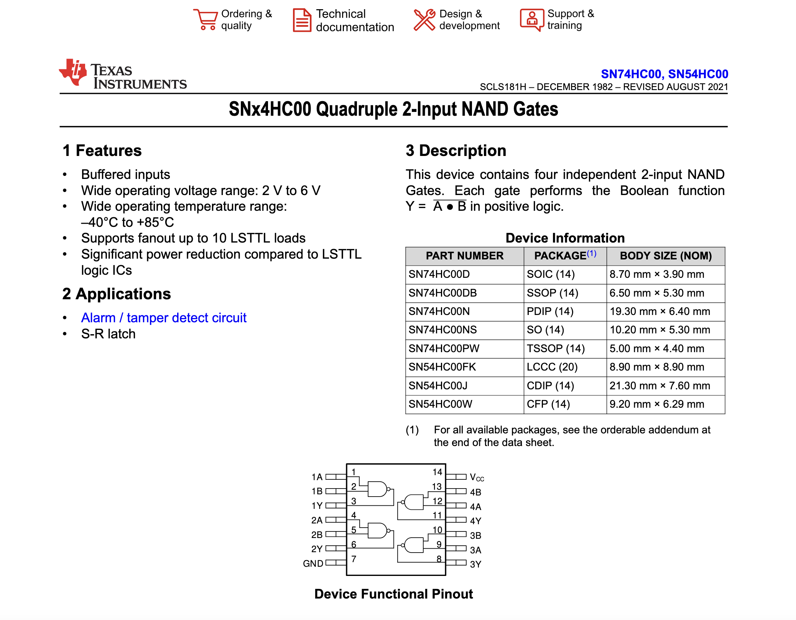
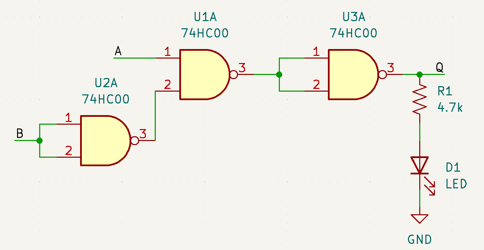

# Electronics Refresher

## Lecture 

### Logic Gates

| A    | Foobar |
|------|--------|
| abcd | bcdfds |

### Theory & Practice

When designing or analyzing the behavior of a digital circuit,
keeping extraneous details hidden and keeping wires organized is a good thing.
This is why typically we draw circuits as a **schematic**,
where we use component **symbols** to represent the pieces of the circuit.

However, when we go to actually build the circuit using the materials at hand, a number of problems appear.
Most notably: our integrated circuit (IC, or simply "chip") doesn't really look much like a NAND gate!

TODO: Image here!

To understand the problem, we need to read the **datasheet** for our IC.
In this case, we're using the 74HC00, whose datasheet is available on [Texas Instruments's Website](https://www.ti.com/lit/ds/symlink/sn74hc00.pdf).

The format (and helpfulness) of a datasheet varies by device and manufacturer,
but typically the information we need is on or near the first page.
For example, we can see the name of the device ("SNx4HC00 Quadruple 2-Input NAND Gates"),
we can see that it works at voltages between 2V and 6V (which is good, because we'll be using 5V),
we can read a brief description of the chip's features,
and most importantly we can find a **pinout diagram** at the bottom.

The pinout diagram reveals to us how the pins on the device function as NAND gates:
each group of three pins is the two inputs and one output of a single gate.
In the bottom left and top right corners are where we supply **power** to the logic gate.

### Power

There are many kinds of transistors and so many kinds of ways to implement digital logic.
This has resulted in a several possible notations for the power pins on ICs, which are mostly interchangable:

**+5V**, **VDD**, and **VCC** all mean the same thing (at least in this class).

**0V**, **VSS**, and **GND** also all mean the same thing (at least in this class).

Any time any of the above pins appears on an IC's datasheet,
you should always make sure that you remember to connect them to the appropriate power supply.

### Floating Logic

_In theory_, any wire in a circuit should always be either HIGH, or LOW.
This is because we try to design our circuits so that all the wires are always
"driven" (strongly) or "pulled" (weakly) to be HIGH or LOW.

For example, if a wire is connected directly to the 5V/GND rail,
we say that it is *driven* (or sometimes "tied", since it's just a wire) HIGH/LOW.
All logic gates drive signals (i.e. they are strong outputs) unless specifically noted otherwise.

If a wire is connected to (for example) the 5V/GND rail through a resistor,
we say that it is *pulled* HIGH/LOW.

The diagram below shows an example setup.
Wire A is being driven HIGH, wire B is being pulled LOW, and wire C is being driven HIGH.
For now, the distinction between driving and pulling a signal is not important, but it will come up later.

What is very important is what happens if a wire isn't being driven or pulled at all:
we say that the wire is **floating**, because it isn't (electrically) connected to a known voltage.
In the above diagram, wire D is floating.
Floating wires are almost always bad in digital circuits because,
depending on your luck, they will switch between HIGH, LOW, and somewhere inbetween seemingly at random.
Not only does this produce difficult-to-debug issues,
but many logic gates will heat up and destroy themselves if they receive an input halfway between HIGH and LOW for too long.

In other words: wire's haunted.

TODO: Why do floating wires behave so erratically?

### The Probe

## Hands-On Section

### New Materials

- Breadboard
- Breadboard Wire Kit
- Male-to-Male Jumper Wires
- 74HC00 4x 2-input NAND Gate
- Debugger PCB
- LED
- Resistor

### Assignment

Build the following logic, which implements "A and not B", on a breadboard.
The debugger should be attached and used for power and for "THE PROBE."

The power rails should be connected to 5V/GND respectively, since they'll be needed later.
Always turn off the power on the debugger when changing wiring,
then turn the power on and **check each part of the circuit** using the probe.

Common problems include:

**Power** - Make sure the debugger is turned on and plugged in (it has a power LED).

**Power Rails** - All 4 power rails should be in the correct state (either HIGH or LOW).

**Wrongly-Bent Pins** - The NAND gate's pins should go into the breadboard holes
that are directly straddling the gap in the center. If the pins are bent too far outwards,
try gently rolling the NAND gate against the table on both sides evenly to bend the pins closer together.

**Pinouts** - The [74HC00 datasheet](https://www.ti.com/lit/ds/symlink/sn74hc00.pdf)
shows how the NAND gates are connected. Note that the side of the chip with the indent is always the top.

**Logic Inputs** - The A and B inputs should always be connected to either 5V or GND, never floating.

**NAND Gate Power** - Always ensure that the NAND gate's VDD and VSS pins are connected to 5V and GND,
respectively.

**NAND Gate Outputs** - The output of each NAND gate should always be HIGH or LOW.
If they are floating, then typically the pinout is wrong or the NAND gate isn't powered.